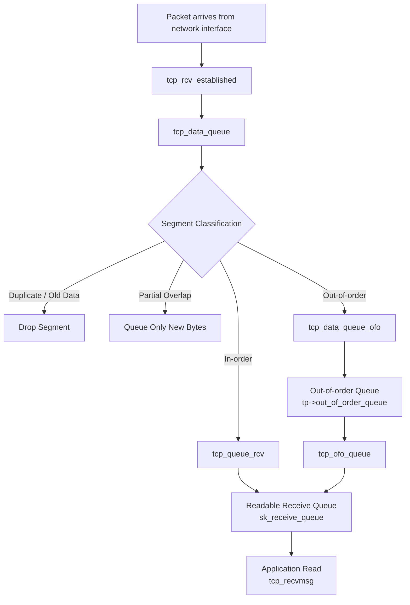
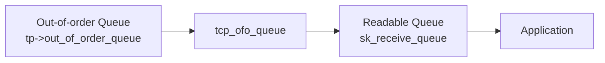

# TCP Receive Pipeline

This document describes the receive-side execution path of TCP segments inside the Linux kernel that is relevant to the instrumentation implemented in this project.

The objective of the instrumentation is to track every payload byte received by the TCP stack until it is eventually consumed by the application.

The pipeline focuses on the kernel functions responsible for:

• classification of received segments  
• insertion of payload into TCP buffers  
• management of out-of-order data  
• promotion of buffered segments into the readable queue  

---

# Receive Path Overview

Incoming packets arrive from the network interface and enter the TCP stack through the receive handler for established connections.

The diagram below describes the simplified pipeline relevant to the instrumentation.



---

# Description of the Pipeline

## Packet arrival

TCP segments arrive from the network device and are passed to the TCP stack.

Established connections are handled by the function

```
tcp_rcv_established()
```

This function handles fast-path receive logic and forwards segments to the main receive processing logic.

---

## Segment classification

The central receive logic is implemented in

```
tcp_data_queue()
```

This function examines the TCP sequence numbers and determines how the segment should be processed.

Possible outcomes include

• in-order data  
• duplicate or already received data  
• partially overlapping data  
• out-of-order data  

Each of these cases follows a different execution path.

---

## In-order data

If the segment begins exactly at the next expected sequence number (rcv_nxt), it is considered in-order.

Such segments are handled by

```
tcp_queue_rcv()
```

The payload is inserted into the readable receive queue

```
sk->sk_receive_queue
```

If possible, the segment payload may be merged with the previous skb in the queue through TCP coalescing.

---

## Duplicate data

If the segment contains only bytes that have already been received earlier, the segment is discarded.

This situation commonly occurs due to retransmissions.

Although the segment is received by the stack, no additional payload is buffered.

---

## Partial overlap

A segment may contain both duplicate and new data.

In this case

• the duplicate prefix is ignored  
• only the new suffix is queued  

This ensures the TCP stream remains strictly ordered.

---

## Out-of-order data

If a segment arrives ahead of missing earlier bytes, it is temporarily stored in the out-of-order queue.

This logic is implemented in

```
tcp_data_queue_ofo()
```

Segments are stored inside an RB-tree structure

```
tp->out_of_order_queue
```

The tree maintains segments ordered by sequence number.

---

## OFO promotion

When the missing sequence gap is filled, previously buffered out-of-order segments may become contiguous with the receive stream.

Promotion of these segments is handled by

```
tcp_ofo_queue()
```

Segments are then moved from the OFO tree into the readable receive queue.

---

# Queue Relationship

TCP maintains two buffering structures for received payload.

Readable queue

```
sk->sk_receive_queue
```

Out-of-order queue

```
tp->out_of_order_queue
```

The conceptual relationship between these structures is illustrated below.



The out-of-order queue temporarily stores segments that cannot yet be delivered due to sequence gaps.

Once the gap is filled, the segments are promoted into the readable queue and become available to the application.